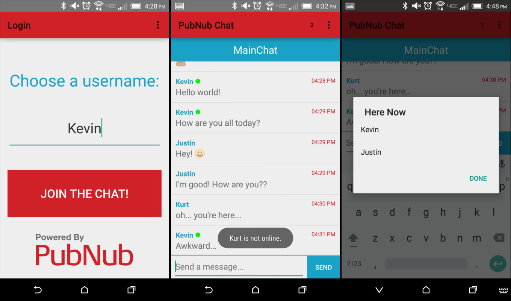
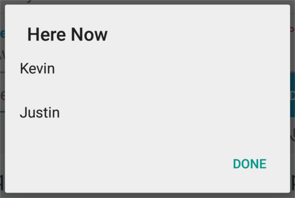
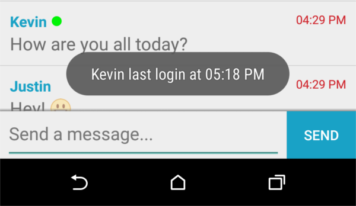

# Android PubNub Lolli-Chat

A simple chatting app that shows off the power of various PubNub features.

## Overview

[Download APK Here](http://kevingleason.me/pubnub-android-lolli-chat/)

This Android chatting app allows a user to create a login identity that is then stored in `SharedPreferences` until logout. The initial chat room is titled `MainChat`, but a user can change chat rooms at any time. An integer in the menu bar indicates how many users are in the current chat room. If you click that `here now` number, a modal with all users in the room is displayed. Clicking on a user in the `here now` modal will display the login time of the corresponding user. Clicking on a message in the chat room will send a poke to that user, notifying them that you are in the chat room.

## PubNub's Role

Let's walk through the various roles PubNub is playing in this Chatting Application...

### Publish/Subscribe

[Publish and Subscribe](http://www.pubnub.com/products/publish-subscribe/) are used to coordinate the basic chatting features of the app. When a user sends a message, the code creates a `ChatMessage` object that holds the username, message text, and timestamp for the given message. `ChatMessage`s are then serialized into a JSONObject and published to all users on the current channel using PubNub.

Then, a message is received using PubNub's `subscribe` method. The `JSONObject` is deserialized back into a `ChatMessage` and added to a list of messages from the current chat room.

### Presence

[Presence](http://www.pubnub.com/docs/android-java/presence) is used to determine what users in the chatroom are online in realtime. If a user is online, a green dot is displayed next to their name. Join and Leave events are updated in real time as well so when a user logs off, you are notified immediately.

### Here Now

Presence updates the number of users currently in a room, but when you want to see the users currently in the chat, `hereNow` is used. A modal opens and is populated with the users currently subscribed to the chat room. Clicking on a user will tell you their login time, and the modal can be dismissed by clicking `done`.

### Storage & Playback

[Storage & Playback](http://www.pubnub.com/products/storage-and-playback/) is used when a user opens the app and is sent to `MainChat`, or when a user changes rooms. A call to PubNub's `history` function loads the last 100 messages from the current channel so you know what other users have been talking about when you join.

### State API

The PubNub [State API](http://www.pubnub.com/docs/android-java/presence) allows you to define state data on the current channel. You can attach an object to your UUID that is accessible to anyone on the channel. This chat app uses the state API to attach login time to all online users' UUIDs. When a user in the `here now` modal is clicked, their login time is read from the state of the channel and displayed in a `Toast` message.

### Push Notifications

PubNub makes push notifications easy. Simple enable push notifications on a channel and attach your GCM device ID to that channel and you are all set to receive pushes. When you tap a user's message in a chat room, a PubNub push notification is sent through GCM protocols to notify the user that you are waiting for them.

### Make it your own!

I encourage you to expand on this application! You could incorporate chat room features, perhaps using `hereNow` with an empty channel parameter to show users all active chat rooms and their occupancies. If you choose to do this, you will need your own Pub and Sub keys. To get these, [sign up for a PubNub account](http://www.pubnub.com/get-started/), it's quick and easy! You can find your unique PubNub keys in the [PubNub Developer Dashboard](https://admin.pubnub.com). Then, enable and customize the Presence, Storage & Playback, and Push Notification features. Once you have done this, simply replace the `String` values for `PUBLISH_KEY` and `SUBSCRIBE_KEY` in `me.kevingleason.pubnubchat.Constants`. 

To enable Push Notifications, you will need to [register your app for GCM](https://developers.google.com/cloud-messaging/android/client). You will then receive an API Key which you can use to enable Push Notifications in the [PubNub Developer Dashboard](https://admin.pubnub.com), as well as a Sender ID which you should use to replace the `GCM_SENDER_ID` in the `me.kevingleason.pubnubchat.Constants` file.
